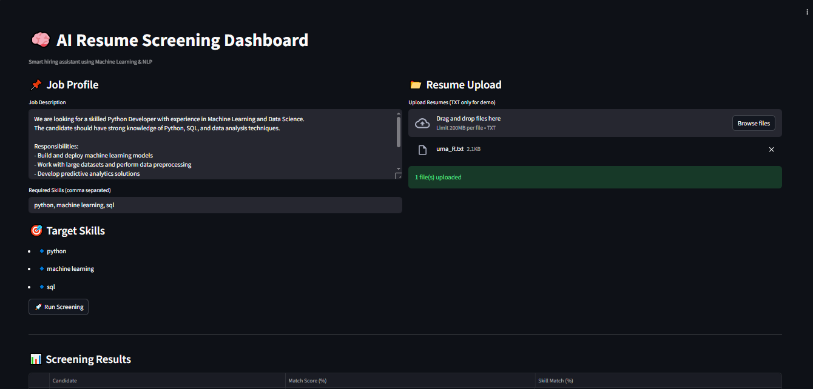

#  AI Resume Screening Dashboard

An AI-powered Resume / Candidate Screening System that helps recruiters automatically analyze resumes and match them with job descriptions using Machine Learning and Natural Language Processing (NLP).

---

##  Project Overview

Hiring the right candidate is time-consuming when done manually.  
This project automates the process by:

-  Analyzing job descriptions
-  Processing candidate resumes
-  Calculating similarity scores
-  Ranking candidates based on job fit

---

##  Features

-  Job Description Input
-  Resume Upload (TXT for demo)
-  Skill-based Matching
-  Candidate Ranking Dashboard
-  Top Candidate Highlight
-  Candidate Insight Cards
-  Professional UI using Streamlit

---

##  Tech Stack

- Python
- Streamlit
- Scikit-learn
- TF-IDF Vectorizer
- Cosine Similarity
- Pandas

---

##  How It Works

1. Enter a Job Description  
2. Add Required Skills  
3. Upload resumes (or use sample data)  
4. System calculates similarity using TF-IDF  
5. Candidates are ranked based on match score  

---

## 📸 Project Output

### 🔹 Dashboard View

---

## Author
Paluri Uma Naga Srinivas

